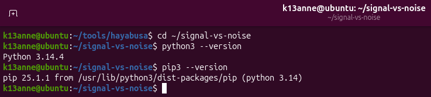
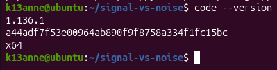
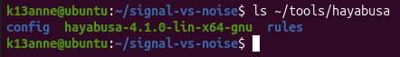
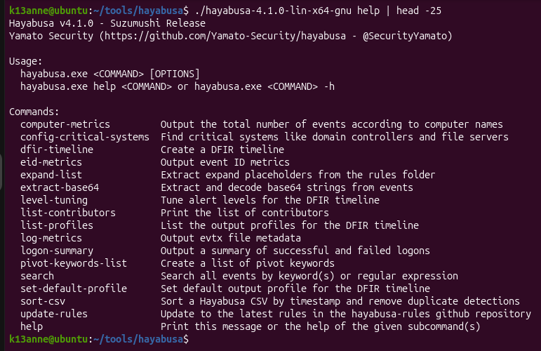

# Setup Notes

## Tool List

**Installed in Week 1:**
- Ubuntu (in VirtualBox)
- Git and GitHub
- VS Code
- Python 3 (with pip and venv)
- Hayabusa 4.1.0

**Planned for later weeks:**
- Sigma rules (I will write them in Week 2)
- Streamlit and Plotly (for the dashboard, Weeks 3 to 4)

## What I Did
- Installed Git on my Ubuntu VM and set up an SSH key for GitHub
- Created my GitHub repository and the project folders
- Installed VS Code
- Checked Python 3 and installed pip and venv
- Downloaded Hayabusa 4.1.0 (Linux version) and put it in a tools folder outside my repo
- Ran the update-rules command to get the latest rules, and there were no errors

## Screenshots

## Problems I Had
- Git was not installed at first, so I installed it
- GitHub did not accept my SSH key at first, so I added it again
- My documentation files had the wrong names, so I renamed them
- I could not find the Hayabusa zip file at first, so I searched for it
